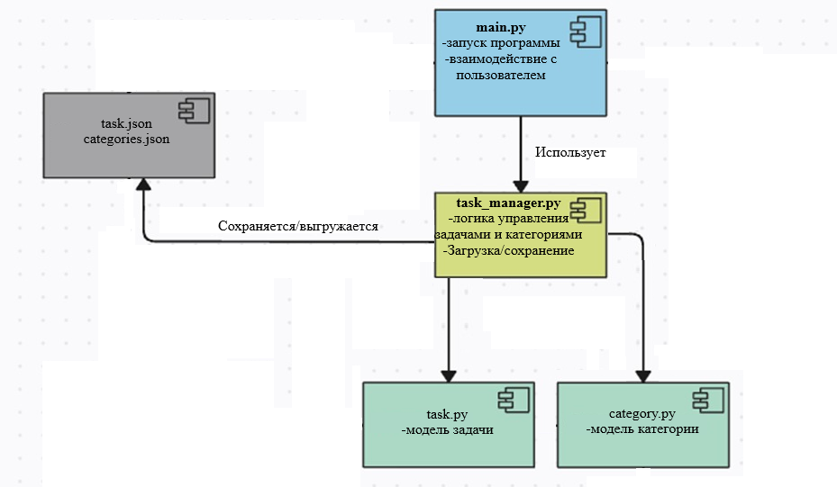
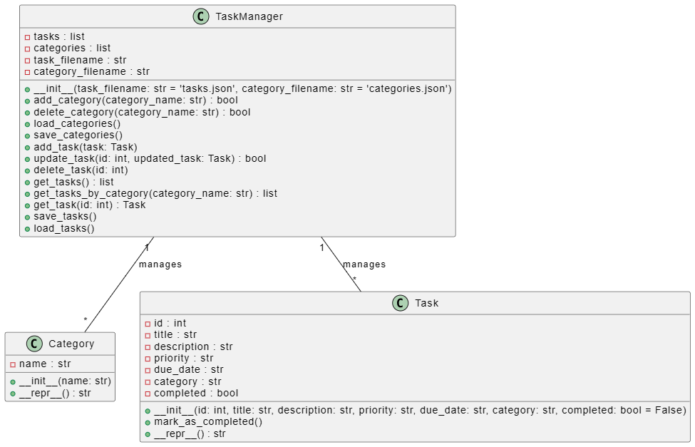

# TaskManager

## Описание проекта

*TaskManager — это приложение для управления задачами и категориями задач. Основная цель приложения заключается в упрощении организации и отслеживания задач. Пользователи могут добавлять, обновлять, удалять задачи, а также управлять категориями, к которым эти задачи принадлежат и отмечать те что уже выполнены или не выполнены.*

## Функциональность

- **Добавление задач** с заголовком, описанием, приоритетом и сроком выполнения.
- **Обновление существующих задач** по идентификатору.
- **Удаление задач**.
- **Просмотр всех задач** или задач по категориям.
- **Пометка задач как выполненные**.
- **Управление категориями**: создание и удаление категорий.
  
## Установка и запуск

Для установки и запуска проекта выполните следующие шаги:
1. **Клонируйте репозиторий**:
   - Вы можете сделать это с помощью команд Git (например, используя терминал PyCharm) или просто скачать все файлы работы репозитория.
   - **Важно:** Если вы скачиваете файлы, убедитесь, что вы помещаете их в одну папку.
2. Убедитесь, что у вас установлен Python.
3. Запустите файл `start_project.bat`, чтобы автоматически создать виртуальное окружение и запустить приложение. 

## Инструкция использования:
### Основное меню 
После запуска программы вам будет представлено основное меню с доступными действиями:

1. **Добавить задачу**: Позволяет добавить новую задачу.
2. **Обновить задачу**: Позволяет обновить уже существующую задачу.
3. **Удалить задачу**: Удаляет задачу по ID.
4. **Просмотреть все задачи**: Отображает все задачи с возможностью фильтрации по категориям.
5. **Пометить задачу как выполненную**: Отмечает задачу как завершенную.
6. **Создать категорию**: Создает новую категорию для задач.
7. **Удалить категорию**: Удаляет выбранную категорию и все связанные с ней задачи.
8. **Просмотреть все категории**: Отображает все существующие категории.
0. **Выход**: Выход из программы.

## Список используемых технологий
- Язык программирования: Python
- Формат хранения данных: JSON

## Стратегия ветвления
В данном проекте реализована стратегия ветвления "Release Train Workflow". Эта стратегия позволяет командам параллельно работать над различными фичами и обновлениями, планируя совместные релизы в заранее определенные сроки. Каждая новая функция или исправление добавляется в отдельную ветку, что упрощает управление кодом и позволяет избежать конфликтов.

### Архитектура приложения
Проект организован в виде простых классов `Task` и `Category`, а управление задачами осуществляется через класс `TaskManager`, который взаимодействует с файлами `tasks.json` и `categories.json`.

Проект может быть расширен, включая дополнительные функции, такие как загрузка и сохранение задач из внешних файлов (в разработке), а также возможность удаления задач и категорий.

## Диаграмма компонентов

## Диаграмма классов

## Примечания
Если у вас возникнут проблемы с запуском или работой программы, убедитесь, что все файлы находятся в одной директории и соответствуют приведенной структуре.
